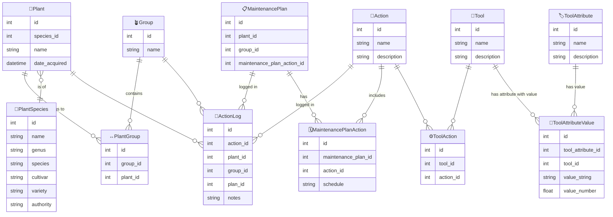

```mermaid
erDiagram
    🌱Plant ||--o{ ↔️PlantGroup : "belongs to"
    🪴Group ||--o{ ↔️PlantGroup : "contains"

    🌱Plant }o--|| 🧬PlantSpecies : "is of"

    🫳Action ||--o{ 📒ActionLog : "logged in"
    🌱Plant ||--o{ 📒ActionLog : ""
    🪴Group ||--o{ 📒ActionLog : ""
    📋MaintenancePlan ||--o{ 📒ActionLog : "logged in"

    📋MaintenancePlan ||--o{ 🗓️MaintenancePlanAction : "has"
    🫳Action ||--o{ 🗓️MaintenancePlanAction : includes

    🔧Tool ||--o{ ⚙️ToolAction : ""
    🫳Action ||--o{ ⚙️ToolAction : ""

    🔧Tool ||--o{ 💾ToolAttributeValue : "has attribute with value"
    🏷️ToolAttribute ||--o{ 💾ToolAttributeValue : "has value"

    %% Entities
    🌱Plant {
        int id
        int species_id
        string name
        datetime date_acquired
    }

    🧬PlantSpecies {
        int id
        string name
        string genus
        string species
        string cultivar
        string variety
        string authority
    }

    🪴Group {
        int id
        string name
    }

    ↔️PlantGroup {
        int id
        int group_id
        int plant_id
    }

    🫳Action {
        int id
        string name
        string description
    }

    📒ActionLog {
        int id
        int action_id
        int plant_id
        int group_id
        int plan_id
        string notes
    }

    📋MaintenancePlan {
        int id
        int plant_id
        int group_id
        int maintenance_plan_action_id
    }

    🗓️MaintenancePlanAction {
        int id
        int maintenance_plan_id
        int action_id
        string schedule
    }

    🔧Tool {
        int id
        string name
        string description
    }

    ⚙️ToolAction {
        int id
        int tool_id
        int action_id
    }

    🏷️ToolAttribute {
        int id
        string name
        string description
    }

    💾ToolAttributeValue {
        int id
        int tool_attribute_id
        int tool_id
        string value_string
        float value_number
    }
```